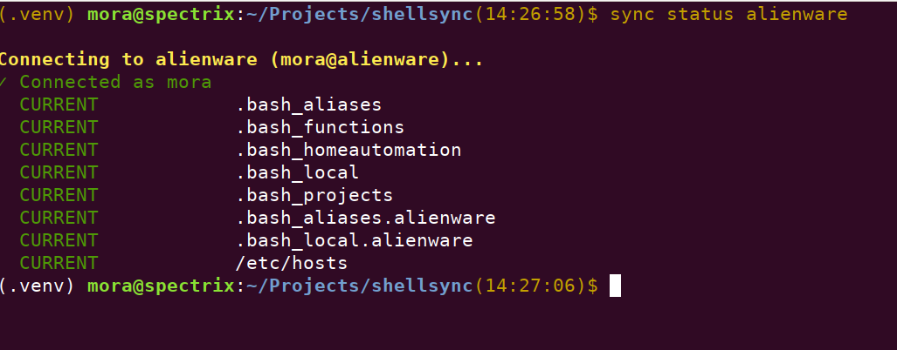

# shellsync

I wanted a simple way to keep my shell environment synchronized 
across multiple Linux machines without the complexity of a full 
configuration management system. shellsync focuses on a single 
job—keeping personal configuration files in sync safely and 
predictably.

## Why shellsync?

Unlike simple copy scripts, `shellsync`:

- compares files using SHA-256 checksums
- transfers only changed files
- creates backups before overwriting files
- verifies uploads after transfer
- supports host-specific configuration
- safely manages selected system files

## Features

- SSH/SFTP-based synchronization
- SHA-256 checksum comparison
- Dry-run mode
- Status reporting
- Automatic backups
- Host-specific configuration
- System file synchronization
- Upload verification

## Quick Start

```bash
git clone <repository>
cd shellsync

python -m venv .venv
source .venv/bin/activate

pip install -e .

shellsync status alienware
shellsync push alienware --dry-run
shellsync push alienware
```

## Screenshots



## Installation

```bash
git clone ...
cd shellsync

python -m venv .venv
source .venv/bin/activate
pip install -e .
```

## Project Layout

```
shellsync/
├── files/
│   ├── common/
│   ├── hosts/
│   │   ├── alienware/
│   │   └── r400/
│   └── system/
│       └── hosts
├── sync.toml
└── src/
```

## Configuration

Example `sync.toml`:

```toml
source_directory = "files"
backup = true

[[hosts]]
name = "alienware"
address = "alienware"
username = "mora"

[[hosts]]
name = "r400"
address = "192.168.1.119"
username = "pi"

[[items]]
source = "common/.bash_aliases"
destination = ".bash_aliases"

[[items]]
source = "common/.bash_functions"
destination = ".bash_functions"
```

## Usage

Check synchronization status:

```bash
shellsync status alienware
```

Preview changes:

```bash
shellsync push alienware --dry-run
```

Synchronize files:

```bash
shellsync push alienware
```

Synchronize multiple hosts:

```bash
shellsync push alienware r400
```

## Host-specific files

Files placed in:

```
files/hosts/<hostname>/
```

are uploaded as:

```
.<filename>.<hostname>
```

Example:

```
files/hosts/r400/.bash_aliases
```

becomes:

```
~/.bash_aliases.r400
```

## System files

Currently supported:

- `/etc/hosts`

System files are:

- compared using SHA-256
- uploaded via `sudo`
- backed up before replacement
- verified after installation

## Typical workflow

```bash
shellsync status r400
shellsync push r400 --dry-run
shellsync push r400
shellsync status r400
```

## Screen shot


## Exit codes

| Code | Meaning |
|-----:|---------|
| 0 | Success |
| 1 | Synchronization completed with errors |
| 2 | Invalid command or configuration |

## Requirements

- Python 3.11+
- OpenSSH server
- `sha256sum`
- Passwordless SSH authentication (recommended)
- Passwordless `sudo` for managed system files

## Roadmap

Planned features:

- `shellsync doctor`
- Improved diagnostics
- Automated test suite
- Additional managed system files

## License

MIT
